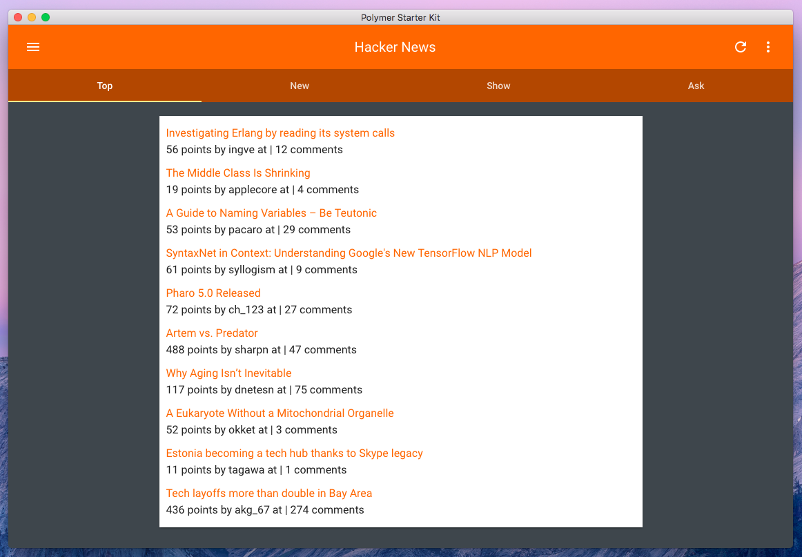

## Hacker News Client

> A simple hacker news client built with Polymer and Electron

### Installation

Install dependencies via bower and npm

```bash
npm install && bower install
```
Start the application

```bash
npm start
```

Currently the app is configured for development, but to use Gulp you will need to change all the references to the bower packages in `elements.html` and each element to point to one directory lower in the hierarchy (because of the way that packaging is done). You will also need to modify `index.js` as follows:

```javascript
// and load the index.html of the app.
mainWindow.loadURL('file://' + __dirname + '../dist/index.html')
```

To create a distribution version run

```bash
gulp
```

Which will create a `dist` with all of the elements vulcanized and the scripts / css minified for production.

### Todo
- [ ] Functionality for toolbar buttons (refresh, menu)
- [ ] Ability to view comments
- [ ] Ability to sign in
